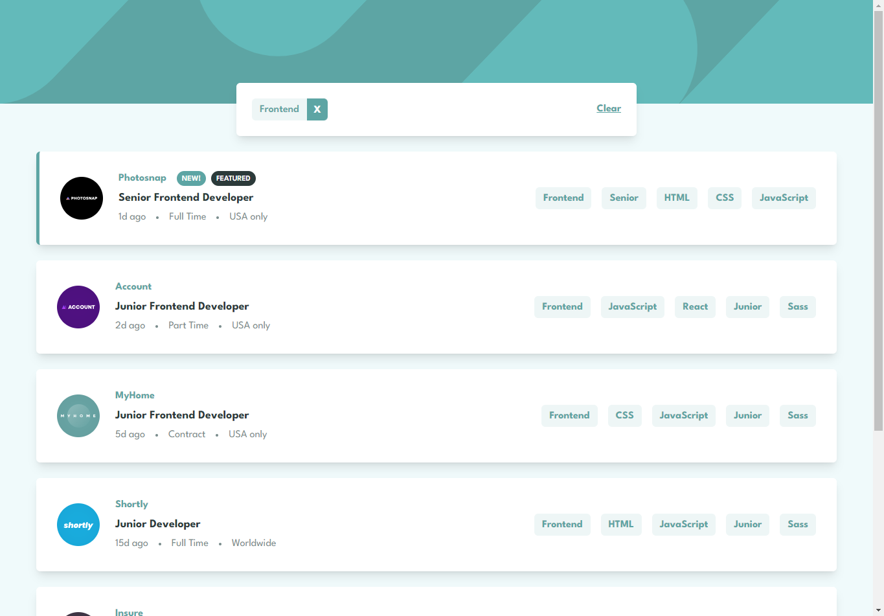
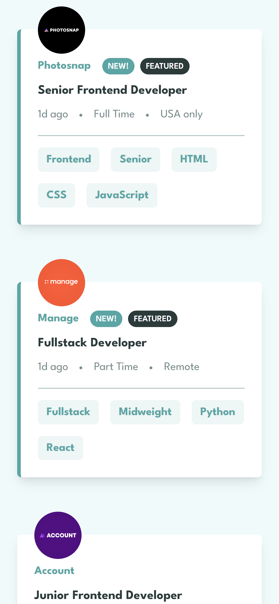

# Frontend Mentor Challenge: Job listings with filtering

Difficulty: 3intermediate

This is my project for the Job listings with filtering challenge from Frontend Mentor. The challenge was to create a responsive web page based on the provided design.

## Overview

The goal of this challenge was to develop my front-end skills by implementing a provided web page design using HTML, CSS, and possibly JavaScript. I decided to approach this challenge using **NextJS, React, TailwindCSS, tRPC, Prisma, Typescript, and Planetscale** for a more dynamic approach with a small backend.

## Demo

You can view a live demo of my project [here](https://job-listings-with-filtering-tquintal.vercel.app/).

## Screenshots

## Resources

- [Challenge Design](/design)
- [Challenge Specifications](https://www.frontendmentor.io/challenges/job-listings-with-filtering-ivstIPCt)
